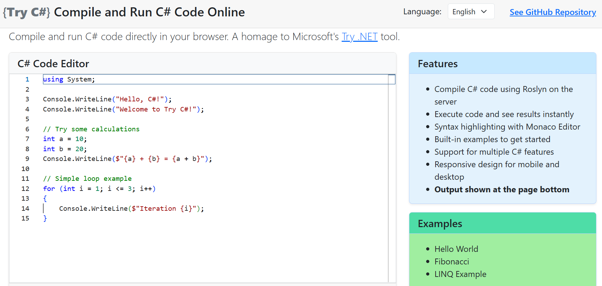

# Try C# - Compile and Run C# Code in the Browser

A web application created as a tribute to Microsoft's [Try .NET](https://github.com/dotnet/try). It lets you write, compile, and run C# code directly in your browser, with Roslyn compiler services handling the heavy lifting on the server.

The application is now fully feature-complete and will be hosted on a platform that supports .NET 8.0, ensuring backward compatibility. **The final public URL is still to be confirmed, so keep an eye on this repo for updates!**



## Features

- **C# Code Compilation**: Uses Roslyn compiler services to compile C# code on the server
- **Real-time Execution**: Runs compiled code and returns results instantly
- **Monaco Editor**: Professional code editor with syntax highlighting and IntelliSense-like features
- **Real-time Output**: See execution results immediately in the browser
- **Built-in Examples**: Learn C# with ready-to-run examples
- **Responsive Design**: Works on both desktop and mobile devices

## Quick Start

### Prerequisites

- [.NET 8.0 SDK](https://dotnet.microsoft.com/download/dotnet/8.0) or higher
- Git (or Portable Git) for version control

### Local Development

1. Clone the repository and navigate to the project directory:
```bash
git clone https://github.com/Pac-Dessert1436/TryCSharp.git
cd TryCSharp
```

2. Restore dependencies, build, and run the application:
```bash
dotnet restore
dotnet build
dotnet run
```

3. Open your browser to the `localhost` port shown in the console (typically `https://localhost:7000`).

## How It Works

### Architecture

- **Frontend**: Blazor Server application with SignalR for real-time communication
- **Code Editor**: Monaco Editor with C# language support
- **Compiler**: Microsoft.CodeAnalysis.CSharp.Scripting for server-side compilation
- **Execution**: .NET runtime on the server

### Key Components

1. **Monaco Editor Integration**: Provides a professional coding environment with syntax highlighting
2. **Roslyn Scripting**: Compiles and executes C# code dynamically on the server
3. **API Endpoint**: `/api/code/run` handles code compilation and execution requests
4. **Console Output Capture**: Redirects Console.WriteLine output to the browser
5. **Error Handling**: Comprehensive error reporting for compilation and runtime errors

## Built-in Examples

The application includes three rudimentary C# examples:

- **Hello World**: Basic console output
- **Fibonacci Sequence**: Mathematical algorithm demonstration
- **LINQ Operations**: Modern C# features with LINQ

## Technology Stack

- **.NET 8.0**: Latest .NET framework
- **Blazor Server**: Server-side web framework with SignalR
- **Roslyn Compiler**: C# compilation services
- **Monaco Editor**: VS Code's editor component
- **Bootstrap 5**: Responsive UI framework

## Contributing

Contributions are welcome! Please feel free to submit issues, feature requests, or pull requests.

### Development Setup

1. Fork the repository
2. Create a feature branch
3. Make your changes
4. Test locally
5. Submit a pull request

## License

This project is licensed under the BSD 3-Clause License. See the [LICENSE](LICENSE) file for details.

## Acknowledgments

- Inspired by Microsoft's "Try .NET" project
- Built with Blazor Server and Roslyn compiler services
- Monaco Editor for the code editing experience

## Support

If you encounter any issues or have questions:

1. Check the [GitHub Issues](https://github.com/Pac-Dessert1436/TryCSharp/issues)
2. Create a new issue with detailed information

---

**Happy coding with C#!** 🚀